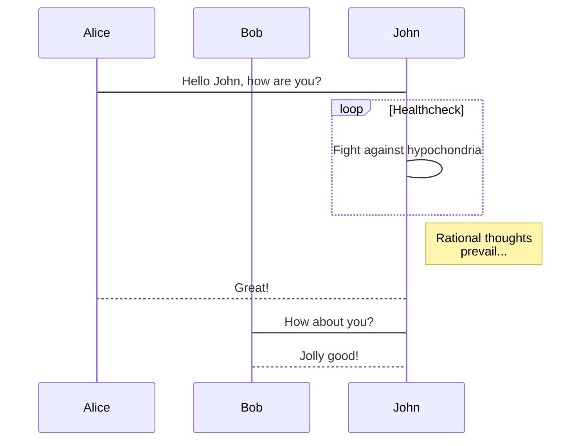
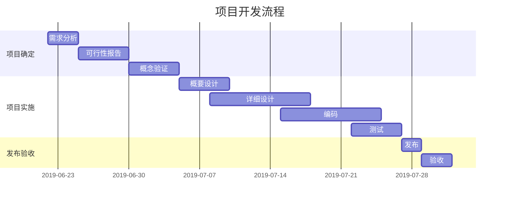

* * *

# 欢迎使用 `Arya` 在线 Markdown 编辑器

```
[Arya](https://markdown.lovejade.cn/?utm_source=markdown.lovejade.cn),是一款基于 `Vue`、`Vditor`,为未来而构建的在线 Markdown 编辑器;轻量且强大：内置粘贴 HTML 自动转换为 Markdown,支持流程图、甘特图、时序图、任务列表,可导出携带样式的图片、PDF、微信公众号特制的 HTML 等等。
```

* * *

## 如何使用

**微注**：清空目前这份默认文档,即处于可使用态。[Arya](https://markdown.lovejade.cn/?utm_source=markdown.lovejade.cn) 另一大优点在于：编辑内容只会在您本地进行保存,不会上传您的数据至服务器,**绝不窥测用户个人隐私,可放心使用**;Github 源码：[markdown-online-editor](https://github.com/nicejade/markdown-online-editor),部分功能仍在开发🚧,敬请期待。

<unk> <unk> <unk>[所见即所得](https://hacpai.com/article/1577370404903?utm_source=github.com)<unk> <unk> ,<unk> <unk> `<unk> -<unk> -M`(`Ctrl-<unk> -M`)<unk> <unk> <unk> ;<unk> <unk> <unk> <unk> <unk> <unk> <unk>：

-   所见即所得：`⌘-⌥-7`(`Ctrl-alt-7`);
-   即时渲染：`⌘-⌥-8`(`Ctrl-alt-8`);
-   分屏渲染：`⌘-⌥-9`(`Ctrl-alt-9`);

### PPT <unk> <unk>

如果您用作 `PPT` 预览(入口在`设置`中),需要注意,这里暂还不能支持各种图表的渲染;您可以使用 `---` 来定义水平方向上幻灯片,用 `--` 来定义垂直幻灯片;更多设定可以参见 [RevealJs 文档](https://github.com/hakimel/reveal.js#table-of-contents)。

* * *

## 什么是 Markdown

[Markdown](https://nicelinks.site/tags/Markdown/?utm_source=markdown.lovejade.cn) 是一种方便记忆、书写的纯文本标记语言，用户可以使用这些标记符号，以最小的输入代价，生成极富表现力的文档：譬如您正在阅读的这份文档。它使用简单的符号标记不同的标题，分割不同的段落，**粗体**、_斜体_ 或者[超文本链接](https://vue-cli3.lovejade.cn/explore/)，更棒的是，它还可以：

* * *

### 1.  制作待办事宜 `Todo` 列表

-   [x] 🎉 通常 `Markdown` 解析器自带的基本功能;
-   [x] 🍀 支持**流程图**、**甘特图**、**时序图**、**任务列表**;
-   [x] 🏁 支持粘贴 HTML 自动转换为 Markdown;
-   [x] 💃🏻 支持插入原生 Emoji、设置常用表情列表;
-   [x] 🚑 支持编辑内容保存**本地存储**,防止意外丢失;
-   [x] 📝 支持**实时预览**,主窗口大小拖拽,字符计数;
-   [x] 🛠 支持常用快捷键(**Tab**),及代码块添加复制
-   [x] ✨ 支持**导出**携带样式的 PDF、PNG、JPEG 等;
-   [x] ✨ 升级 Vditor,新增对 `echarts` 图表的支持;
-   [x] 👏 支持检查并格式化 Markdown 语法,使其专业;
-   [x] 🦑 <unk> <unk> <unk> <unk> <unk> <unk> <unk> <unk> [<unk> <unk> <unk> <unk> <unk> <unk> <unk> <unk> <unk> <unk> <unk> <unk> <unk> ](https://github.com/b3log/vditor/issues/117?utm_source=hacpai.com#issuecomment-526986052);
-   [x] 🌟 增加对**所见即所得**编辑模式的支持(`⌘-⇧-M`);

* * *

### 2.  书写一个质能守恒公式[^LaTeX]

$$
E=mc^2
$$

* * *

### 3.  高亮一段代码[^code]

```js
// 给页面里所有的 DOM 元素添加一个 1px 的描边(outline);
[].forEach.call($$("*"),function(a){
  a.style.outline="1px solid #"+(~~(Math.random()*(1<<24))).toString(16);
})
```

### 4.  <unk> <unk> <unk> <unk>[流程图](https://github.com/knsv/mermaid#flowchart)

```mermaid
график TD;
  B[Вклад в сообщество ILLA<br>]
  A[Создать агента AI/ILLA App]-->B[Внести свой вклад в сообщество ILLA];
  B[Contribute to ILLA Community]-->C[Submit PR on GitHub];
  C[Submit PR on GitHub]-->D[Win the prize];
```

```mermaid
график TD;
  A-->B;
  B-->C;
  C-->D;
```

### 5.  高效绘制[序列图](https://github.com/knsv/mermaid#sequence-diagram)



### 6.  <unk> <unk> <unk> <unk>[甘特图](https://github.com/knsv/mermaid#gantt-diagram)

> **甘特图**内在思想简单。基本是一条线条图,横轴表示时间,纵轴表示活动(项目),线条表示在整个期间上计划和实际的活动完成情况。它直观地表明任务计划在什么时候进行,及实际进展与计划要求的对比。



### 7.  支持图表

```echarts
{
  "backgroundColor": "#2121",
  "title": {
    "text": "<unk> <unk> <unk> <unk> <unk> <unk> <unk> <unk> <unk> <unk> ",
    "подтекст": "2019 <unk> 6 <unk> <unk> ",
    "x": "центр",
    "textStyle": {
      "color": "#f2f2f2"
    }
  },
  "tooltip": {
    "trigger": "item",
    "форматтер": "{a} <br/>{b} : {c} ({d}%)"
  },
  "legend": {
    "orient": "вертикаль",
    "слева": "слева",
    "данные": [
      "<unk> <unk> <unk> <unk> ",
      "<unk> <unk> <unk> ",
      "<unk> <unk> ",
      "<unk> "
      "<unk> <unk> <unk> "
    ],
    "textStyle": {
      "color": "#f2f2f2"
    }
  },
  «серии»: [
    {
      «имя»: «<unk> <unk> <unk> »,
      "type": "pie",
      "радиус": "55%",
      "центр": [
        "50%",
        "60%"
      ],
      "data": [
        {
          "value": 10440,
          "name": "<unk> <unk> <unk> ",
          "itemStyle": {
            "color": "#ef4136"
          }
        },
        {
          "значение": 4770,
          "name": "<unk> <unk> <unk> "
        },
        {
          "value": 2430,
          "name": "<unk> "
        },
        {
          "value": 342,
          "name": "<unk> "
        },
        {
          "значение": 18,
          "name": "<unk> <unk> "
        }
      ],
      "itemStyle": {
        "emphasis": {
          "shadowBlur": 10,
          "shadowOffsetX": 0,
          "shadowColor": "rgba(0, 0, 0, 0. )"
        }
      }
    }
  ]
}
```

> **备注**：上述 echarts 图表📈,其数据,须使用严格的 **JSON** 格式;您可使用 JSON.stringify(data),将对象传换从而得标准数据,即可正常使用。

### 8.  绘制表格

| 作品名称              | 在线地址                                                                                         |    上线日期    |
| :---------------- | :------------------------------------------------------------------------------------------- | :--------: |
| 倾城之链              | [https://nicelinks.site](https://nicelinks.site/??utm_source=markdown.lovejade.cn)           | 2017-09-20 |
| 晚晴幽草轩             | [https://jeffjade.com](https://jeffjade.com/??utm_source=markdown.lovejade.cn)               | 2014-09-20 |
| <unk> <unk> <unk> | [http://quickapp.lovejade.cn](http://quickapp.lovejade.cn/??utm_source=markdown.lovejade.cn) | 2019-01-12 |

### 9.  更详细语法说明

<unk> <unk> <unk> <unk> <unk> <unk> <unk> <unk> <unk> <unk> <unk> ,<unk> <unk> <unk> <unk> <unk> [Markdown <unk> <unk> <unk> <unk> <unk> ](https://github.com/nicejade/nice-front-end-tutorial/blob/master/tutorial/markdown-tutorial.md),<unk> <unk> <unk> <unk> <unk> <unk> <unk> <unk> <unk> <unk> <unk> <unk> <unk> <unk> <unk> <unk> <unk> <unk> <unk> <unk> ,<unk> <unk> <unk> <unk> <unk> <unk> <unk> <unk> ,<unk> <unk> <unk> <unk> <unk> <unk> <unk> <unk> <unk> <unk> <unk> <unk> <unk> <unk> <unk> <unk>

总而言之,不同于其它_所见即所得_的编辑器：你只需使用键盘专注于书写文本内容,就可以生成印刷级的排版格式,省却在键盘和工具栏之间来回切换,调整内容和格式的麻烦。**Markdown 在流畅的书写和印刷级的阅读体验之间找到了平衡。** 目前它已经成为世界上最大的技术分享网站 `GitHub` 和 技术问答网站 `StackOverFlow` 的御用书写格式,而且越发流行,正在在向各行业渗透。

最新更新于 2019.08.21
